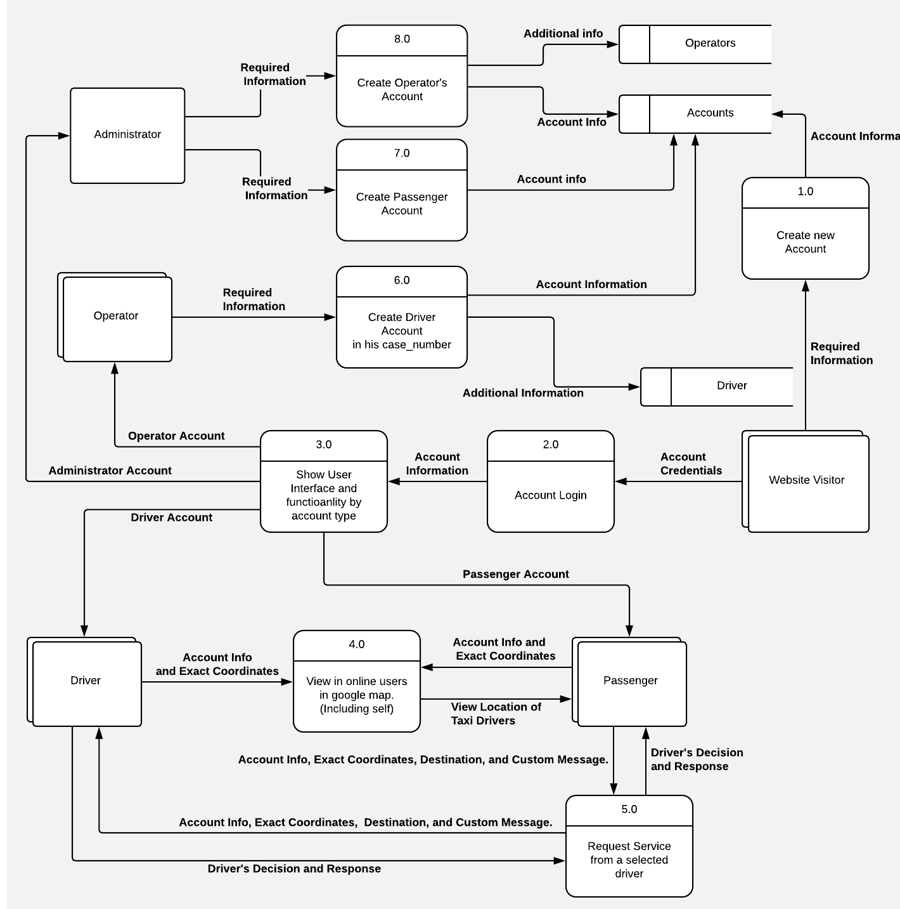

<h2 align="center">TaxiTap</h2>

    Real-time taxi tracing system with driver-to-passenger smart contract powered with Google Maps API.

## Database Entity Relationship

    
     

## UML Data Flow Diagram

    
     

## Copyright and License
This project is licensed under the MIT License - see the [LICENSE](LICENSE) file for details.